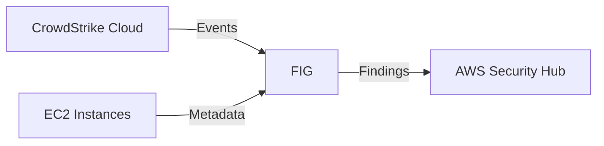

# AWS Security Hub Manual Deployment Guide

This guide will walk you through the steps to manually deploy the Falcon Integration Gateway on
an AWS EC2 instance. FIG is a single, statically linked Go binary (`fig`), distributed as a
prebuilt binary and as a container image — there is no language runtime to install.

## Table of Contents

- [Prerequisites](#prerequisites)
- [Architecture Overview](#architecture-overview)
- [Deployment Steps](#deployment-steps)
  - [1. Enable CrowdStrike Integration in Security Hub](#1-enable-crowdstrike-integration-in-security-hub)
  - [2. Create an Instance Profile](#2-create-an-instance-profile)
  - [3. Create an EC2 Instance (Linux)](#3-create-an-ec2-instance-linux)
  - [4. Deploy the FIG](#4-deploy-the-fig)
  - [5. Run the FIG](#5-run-the-fig)
  - [6. Verify in Security Hub](#6-verify-in-security-hub)
- [Troubleshooting](#troubleshooting)

## Prerequisites

- Falcon API Credentials with the following API scopes:
  - **Event streams**: [Read]
  - **Hosts**: [Read]
- Have appropriate AWS permissions to:
  - Create EC2 instances
  - Create IAM roles/policies
  - Access Security Hub

## Architecture Overview



> [!NOTE]
> Currently, this backend only supports sending detection events that originate from AWS to Security Hub.

## Deployment Steps

### 1. Enable CrowdStrike Integration in Security Hub

Before deploying the FIG, you must enable the CrowdStrike Falcon partner integration in AWS Security Hub. Without this, the FIG will receive `AccessDeniedException` errors when attempting to import findings.

1. Navigate to the [Security Hub console](https://console.aws.amazon.com/securityhub/home) in your target region
1. Click the **Integrations** link in the left navigation
1. Search for **CrowdStrike**
1. Find **CrowdStrike: CrowdStrike Falcon**
1. Click **Accept findings**

> [!NOTE]
> This is a one-time setup per region. If you are deploying the FIG across multiple regions, you must enable the integration in each region.

### 2. Create an Instance Profile

This will be used to grant the EC2 instance access to the Security Hub and EC2 API's.

> :exclamation: If you already have an instance profile that you would like to use, just ensure the role has the appropriate permissions and skip to step 3.

#### 2.1 Create a policy

1. Navigate to the [IAM Policies](https://console.aws.amazon.com/iam/home#/policies) page
1. Click the **Create policy** button
1. Select the **JSON** tab
1. Paste the following policy into the editor:

    ```json
    {
        "Version": "2012-10-17",
        "Statement": [
            {
                "Effect": "Allow",
                "Action": [
                    "ec2:DescribeInstances",
                    "ec2:DescribeRegions",
                    "securityhub:GetFindings"
                ],
                "Resource": "*"
            },
            {
                "Effect": "Allow",
                "Action": "securityhub:BatchImportFindings",
                "Resource": "arn:aws:securityhub:*:*:product/crowdstrike/crowdstrike-falcon"
            }
        ]
    }
    ```

1. Click the **Next** button
1. Give it a name (e.g. `FIG-SecurityHub-Access-Policy`) and click the **Create policy** button

#### 2.2 Create a role

1. Navigate to the [IAM Roles](https://console.aws.amazon.com/iam/home#/roles) page
1. Click the **Create role** button
1. Select **AWS service** as the trusted entity
1. Select **EC2** as the service/use-case that will use this role
1. Click the **Next** button
1. Search for the policy you created in the previous step (e.g. `FIG-SecurityHub-Access-Policy`) and select it
1. Click the **Next** button
1. Give it a name (e.g. `FIG-SecurityHub-Access-Role`) and click the **Create role** button

### 3. Create an EC2 Instance (Linux)

This step is completely up to you. You can use the AWS console, CLI, or any other method you prefer to create an EC2 instance. Just make sure you select the instance profile you created in the previous step
and that you have access to the instance via SSH.

For the purposes of this guide, we will be using the latest Amazon Linux 2023 AMI.

> If you have an existing instance that you would like to use, just ensure the instance has instance profile you created in the previous step and skip to step 4.

#### 3.1 Create an EC2 instance

1. Navigate to the [EC2 Instances](https://console.aws.amazon.com/ec2/v2/home#Instances) page
1. Click the **Launch Instance** button
   1. Fill out the instance details as you see fit
   1. Under **Advanced details**
      1. Select the instance profile you created in the previous step
1. Click the **Launch instance** button

### 4. Deploy the FIG

Connect to your EC2 instance via SSH and follow the steps below to install the FIG.

#### Installation Methods

| Method | Pros | Cons | Best For |
|--------|------|------|----------|
| Container (Docker/Podman) | • No toolchain required<br>• Pinned, reproducible image<br>• Simple updates (`docker pull`) | • Requires a container runtime | Most users |
| From Source / `go install` | • Full source access<br>• Build a native binary | • Requires a Go 1.26+ toolchain<br>• Manual updates | Developers |

#### Choose Your Installation Method

<details><summary>Container (<strong>Recommended</strong>)</summary>

#### 4.1 Install a container runtime

Install Docker (or Podman) using the package manager for your distro. On Amazon Linux 2023:

```bash
sudo dnf install -y docker
sudo systemctl enable --now docker
```

#### 4.2 Pull the FIG image

```bash
docker pull quay.io/crowdstrike/falcon-integration-gateway:latest
```

#### 4.3 Configure and run the FIG

Provide configuration as environment variables (recommended for containers), or mount a config
file at `/etc/fig/config.ini`. Refer to the
[configuration options](../../../config/config.ini) available to the application and backend.

> [!NOTE]
> Instance existence confirmation can be disabled using the `confirm_instance` option in the
> `[aws]` section of `config.ini`, or by setting the `AWS_CONFIRM_INSTANCE` environment variable.
> This option is available for scenarios where the account that is running the service application
> does not have access to the AWS account where the instance with the detection resides.

Run the container with the minimum required environment variables:

```bash
docker run -d --restart unless-stopped \
  -e FIG_BACKENDS=AWS \
  -e EVENTS_SEVERITY_THRESHOLD=3 \
  -e FALCON_CLOUD=<Falcon Cloud Region> \
  -e FALCON_CLIENT_ID=<Falcon Client ID> \
  -e FALCON_CLIENT_SECRET=<Falcon Client Secret> \
  -e FALCON_APPLICATION_ID=<EXAMPLE-SECHUB-APPID> \
  -e AWS_REGION=<AWS Region> \
  quay.io/crowdstrike/falcon-integration-gateway:latest
```

The EC2 instance profile from Step 2 supplies AWS credentials to the container automatically via
the instance metadata service; no static AWS keys are required.

</details>

<details><summary>From Source / <code>go install</code></summary>

#### 4.1 Install a Go toolchain

FIG requires **Go 1.26 or later** to build from source.

```bash
sudo dnf install -y golang git
```

> Use the package manager for your distro, or install Go from <https://go.dev/dl/>, to get a
> 1.26+ toolchain.

#### 4.2 Install the FIG

Install the `fig` binary directly from the module:

```bash
go install github.com/crowdstrike/falcon-integration-gateway/cmd/fig@latest
```

This places a `fig` binary in `$(go env GOPATH)/bin`. Alternatively, clone the repository and
build with `make build`, which produces a `fig` binary in the repository root.

#### 4.3 Configure the FIG

There are two ways to configure the FIG to use the AWS backend: a `config.ini` file, or
environment variables. Refer to the [configuration options](../../../config/config.ini)
available to the application and backend.

> [!NOTE]
> Instance existence confirmation can be disabled using the `confirm_instance` option in the
> `[aws]` section of `config.ini`, or by setting the `AWS_CONFIRM_INSTANCE` environment variable.
> This option is available for scenarios where the account that is running the service application
> does not have access to the AWS account where the instance with the detection resides.

##### 4.3.1 Configure the FIG using a `config.ini` file

Create a `config.ini` file and set the following minimum values. By default FIG searches for a
config file in `/etc/fig` and the current directory, or you can point at one explicitly with the
`--config` flag.

```ini
[gateway]
backends = AWS

[events]
severity_threshold = 3

[falcon]
cloud = <Falcon Cloud Region>
client_id = <Falcon Client ID>
client_secret = <Falcon Client Secret>
application_id = <EXAMPLE-SECHUB-APPID>

[aws]
region = <AWS Region>
```

##### 4.3.2 Configure the FIG using environment variables

Alternatively, set the following minimum environment variables:

```bash
export FIG_BACKENDS=AWS
export EVENTS_SEVERITY_THRESHOLD=3
export FALCON_CLOUD=<Falcon Cloud Region>
export FALCON_CLIENT_ID=<Falcon Client ID>
export FALCON_CLIENT_SECRET=<Falcon Client Secret>
export FALCON_APPLICATION_ID=<EXAMPLE-SECHUB-APPID>
export AWS_REGION=<AWS Region>
```

</details>

### 5. Run the FIG

If you used the container method, the FIG is already running — skip to verifying its output. If
you built the binary from source, start it with:

```bash
fig
```

Verify output. FIG logs structured JSON to stdout:

```json
{"time":"2023-10-18T16:45:43Z","level":"INFO","msg":"starting Falcon Integration Gateway","version":"1.0.0","commit":"abc1234","backends":["AWS"]}
{"time":"2023-10-18T16:45:43Z","level":"INFO","msg":"event channel bounded","queue_depth":256}
{"time":"2023-10-18T16:45:44Z","level":"INFO","msg":"opening streaming connection","whence":0,"offset":0}
```

To read the container logs instead:

```bash
docker logs <container>
```

### 6. Verify in Security Hub

As events are processed by the FIG, they will be sent to Security Hub. You can verify this by following the steps below.

1. Navigate to the [Security Hub](https://console.aws.amazon.com/securityhub/home) page
1. Click the **Findings** tab
1. Add a filter for **Product name** and enter **CrowdStrike Falcon**

---

## Troubleshooting

To get additional logging verbosity, you can set the logging level to `DEBUG` by modifying either the `config.ini` or setting an environment variable.

**Modify the `config.ini`:**

```ini
[logging]
level = DEBUG
```

**Alternatively, set the environment variable:**

```bash
export LOG_LEVEL=DEBUG
```

### `AccessDeniedException` when importing findings

If you see an error like the following:

```json
{"time":"2023-10-18T16:45:44Z","level":"ERROR","msg":"backend delivery failed","backend":"AWS","error":"operation error SecurityHub: BatchImportFindings, AccessDeniedException"}
```

This typically means the CrowdStrike Falcon partner integration has not been enabled in Security Hub. Verify that you have completed [Step 1](#1-enable-crowdstrike-integration-in-security-hub) in the target region. If you are deploying across multiple regions, the integration must be enabled in each region separately.
